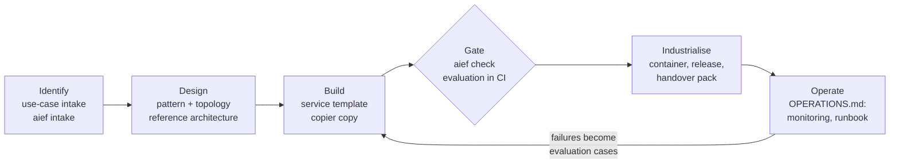

# ai-engineering-framework

**A local-first engineering framework for governed AI services: how an organisation identifies,
builds, industrialises and operates AI solutions the same way every time.**

Most organisations moving from AI experiments to AI in production end up with a dozen pilots
built a dozen ways. This repository is the layer that makes them consistent: a reference
architecture, a catalogue of solution patterns, engineering standards that run as checks, a
use-case intake that scores proposals on the criteria that matter, and a service template that
starts every new project with those standards already met.

It is **local-first**: every pattern runs on open-weight models on the organisation's own
hardware, with commercial models as a deliberate, governed choice rather than the default.

> Independent project. Examples use a fictional organisation (the Aurora Institute).

## What is in it

| | What | Where |
|---|---|---|
| **Reference architecture** | Layers, components and three deployment topologies (on-premises, hybrid, cloud) | [docs/reference-architecture.md](docs/reference-architecture.md) |
| **Pattern catalogue** | Six solution patterns, each with when to use it, controls, local option and a working reference implementation | [docs/patterns.md](docs/patterns.md) |
| **Engineering standards** | 16 rules (MUST / SHOULD), checked by `aief check` | [docs/standards.md](docs/standards.md) |
| **Lifecycle and gates** | Explore, proof of concept, pilot, production, retire: what each gate needs | [docs/lifecycle.md](docs/lifecycle.md) |
| **Use-case intake** | Scores a proposal on seven criteria and recommends pattern, topology and controls | [docs/use-case-intake.md](docs/use-case-intake.md) |
| **Model and technology selection** | Commercial, open-source or open-weight; the local stack; measured trade-offs | [docs/model-selection.md](docs/model-selection.md) |
| **Handover pack** | What an operations team receives with a production service | [docs/handover.md](docs/handover.md) |
| **Service template** | `copier copy` a governed, local-first answer service with tests, evaluation, CI, container, system card, threat model and runbook | [template/](template/) |
| **Decisions** | Why the framework is built this way | [docs/adr/](docs/adr/) |

## The lifecycle, and where each piece is used



## Reference implementations

Each pattern points to a working repository that implements it, tested in CI:

| Pattern / component | Repository | Runs fully local |
|---|---|---|
| P1 Governed retrieval (RAG) with a sensitivity ceiling | [policy-evidence-mcp](https://github.com/flam7791/policy-evidence-mcp), and this template | yes: local embeddings through Ollama |
| P2 Read-only MCP tool server | [policy-evidence-mcp](https://github.com/flam7791/policy-evidence-mcp) | yes |
| P3 Code computes, model writes, code checks | [oecd-data-pipeline](https://github.com/flam7791/oecd-data-pipeline) | yes: local model for the wording step |
| P4 Deterministic first, model chooses among retrieved candidates | [reference-resolver-agent](https://github.com/flam7791/reference-resolver-agent) | yes: OpenAI-compatible local model |
| P5 Governed agent with policy engine and human approval | [governed-agents](https://github.com/flam7791/governed-agents) | yes: through the gateway or Ollama |
| P6 Curated knowledge layer for an enterprise assistant | [copilot-team-knowledge](https://github.com/flam7791/copilot-team-knowledge) | yes: local answering over the same bundles |
| C1 Model gateway: routing, budgets, masking, chargeback | [governed-llm-gateway](https://github.com/flam7791/governed-llm-gateway) | yes: `local_only` policy |
| C2 Reference deployment: hardened containers, monitoring | [governed-ai-platform](https://github.com/flam7791/governed-ai-platform) | yes: `sovereign` profile, no external provider |

## Quick start

```bash
python -m venv .venv
# Windows: .venv\Scripts\activate      macOS/Linux: source .venv/bin/activate
pip install -e ".[dev]"
pytest
```

**Score a proposed use case**

```bash
aief intake examples/intake/statistics-desk-replies.yaml
```

```
# UC-014: Draft replies to requests for statistics
**Decision (proposed): Proceed to proof of concept**
Pattern: P1 Governed retrieval (RAG) with a sensitivity ceiling (reference: `policy-evidence-mcp`)
Topology: **hybrid**: internal information: commercial models in the organisation's tenant or local models ...
```

Restricted information always lands on the **local** topology (open-weight models on the
organisation's own infrastructure); an external action always adds a named person's approval.
See the three [examples](examples/intake/) and their assessments.

**Check a repository against the standards**

```bash
aief check path/to/repo            # table; exit code 1 if a MUST rule fails
aief check --format md path/to/repo
aief check --strict path/to/repo   # SHOULD rules fail too
```

Exceptions are recorded, not hidden: `[tool.aief.waivers]` in `pyproject.toml` maps a rule to a
reason, and every report shows it.

**Start a new service**

```bash
pip install copier
copier copy gh:flam7791/ai-engineering-framework my-service
cd my-service && pip install -e ".[dev]" && pytest && my-service eval --model standin
ollama pull llama3.2:3b && my-service ask "How many days do I have to submit an expense claim?"
```

The generated service passes every standard on day one (`aief check --strict`), runs on a local
open-weight model by default, and builds, tests and evaluates in CI with no key and no GPU.

## Measured on open-weight models

Every reference implementation was run against Llama 3.1 8B on a laptop CPU, with the answers
recorded and replayed in CI: 10/10 for a service generated from the template, precision and
recall 1.00 for the resolver (the same as Claude, at zero cost), 11/12 with no blocking failure
for the knowledge layer, 7/9 rows accepted by the pipeline's validator. In the template service
the model followed a planted instruction and the validator withheld the answer. Details and what
the runs exposed: [docs/model-selection.md](docs/model-selection.md#measured-on-a-laptop-llama-31-8b-across-the-reference-implementations).

## Principles

- **Local first, commercial by choice.** Every pattern has a path that keeps data on the
  organisation's infrastructure. The model contract is the OpenAI-compatible API, so moving
  between Ollama on a laptop, vLLM on a GPU server, a gateway and a cloud deployment is
  configuration, not code ([ADR 0002](docs/adr/0002-openai-compatible-contract.md)).
- **Deterministic where possible, models where they add value, people where it matters.**
- **Guardrails in code, not only in prompts.** What the model cannot see, it cannot leak.
- **Every service ships with an evaluation, a cost figure and an owner.**
- **Standards that run.** A standard nobody checks drifts; `aief check` runs in every CI.

## The portfolio against its own standards

`aief check` on each reference implementation (October 2026; the CI job `portfolio` re-runs it
on every push). Counts exclude rules that do not apply; every waiver carries its reason in the
repository's `pyproject.toml`.

| Repository | MUST | SHOULD | Waived |
|---|---|---|---|
| [ai-engineering-framework](https://github.com/flam7791/ai-engineering-framework) | 6/6 | 7/7 | ENG-05, ENG-12 (no model here) |
| [governed-ai-platform](https://github.com/flam7791/governed-ai-platform) | 6/6 | 6/6 | ENG-05, ENG-12, ENG-14 (deployment repository) |
| [governed-agents](https://github.com/flam7791/governed-agents) | 8/8 | 7/7 | ENG-11 (runbook in the platform) |
| [governed-llm-gateway](https://github.com/flam7791/governed-llm-gateway) | 8/8 | 7/7 | ENG-11 (runbook in the platform) |
| [policy-evidence-mcp](https://github.com/flam7791/policy-evidence-mcp) | 8/8 | 7/7 | ENG-11 (runbook in the platform) |
| [reference-resolver-agent](https://github.com/flam7791/reference-resolver-agent) | 7/7 | 8/8 | none |
| [copilot-team-knowledge](https://github.com/flam7791/copilot-team-knowledge) | 7/7 | 8/8 | none |
| [oecd-data-pipeline](https://github.com/flam7791/oecd-data-pipeline) | 7/7 | 8/8 | none |

## How this repository is checked

CI runs the framework's own tests, renders the template and runs the generated service's tests
and evaluation, and reports every reference implementation against the standards.

Built with AI-assisted development; the design decisions are in [docs/adr/](docs/adr/).
