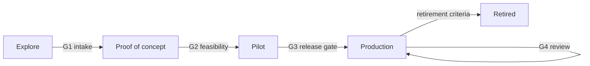

# Lifecycle and gates

Version 0.1 · From a proposal to a service people rely on, and out again. Each gate has an
owner, a short checklist and a decision record. A gate is passed on evidence, not on a demo.

## G1: Explore → proof of concept (2–4 weeks)

- [ ] Intake completed and scored (`aief intake`); decision "Proceed" or "Proceed with conditions"
- [ ] Business owner and owner after launch named
- [ ] Pattern and topology chosen; data classification confirmed with the information owner
- [ ] Ten or more evaluation cases drafted with the business owner, from real examples
- [ ] Repository created from the template; `aief check` passes

## G2: Proof of concept → pilot

- [ ] Evaluation recorded against the intended model; pass rate and safety failures reported
- [ ] Stand-in and replayed runs green in CI
- [ ] Cost per task measured (tokens × price, or zero API cost and the infrastructure needed)
- [ ] Threat model reviewed; residual risks accepted by the business owner
- [ ] Pilot group, duration and success metric fixed **before** the pilot starts

## G3: Pilot → production (the release gate)

- [ ] All MUST rules pass; waivers reviewed
- [ ] Evaluation on the production model, platform-verified (not stand-in only), no safety failure
- [ ] Pilot success metric met; any confirmed failure added to the evaluation set
- [ ] OPERATIONS.md complete: monitoring signals with thresholds, runbook, owner and backup
- [ ] System card current
- [ ] Handover pack delivered to the operating team ([handover.md](handover.md))
- [ ] Previous version tagged for rollback

## G4: Production review (every three months)

- [ ] Usage, quality sample, cost and incidents against thresholds
- [ ] Regression set re-run after any model, prompt or source change since the last review
- [ ] Retirement criteria checked

## Retirement

Usage below threshold for two reviews, a platform deprecated, or a better route available:
switch off, tell users, archive the repository with its last evaluation results.

## Proof of concept or production?

| | Proof of concept | Production |
|---|---|---|
| Model | Whatever answers the feasibility question fastest, often local | The one in the decision record, behind the gateway |
| Data | Sample, at or below the target ceiling | The approved sources only |
| Evaluation | Stand-in and one recorded live run | Recorded run on the production model, replayed in CI, regression set |
| Operation | The builder | A named owner, a runbook, monitoring |
| Exit | Feasible or not, at what cost | Retirement criteria |
