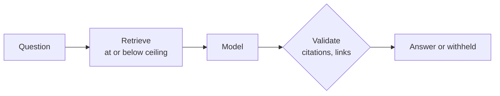
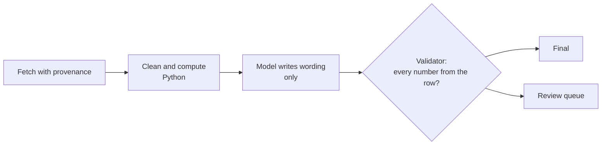
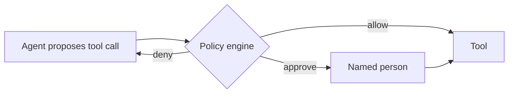
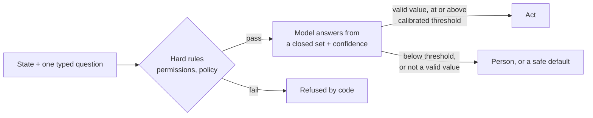

# Pattern catalogue

Version 0.2 · Seven solution patterns cover most enterprise AI use cases seen in a large
knowledge organisation. Each entry says when to use it and when not, the controls it needs, how
it runs locally, and which repository implements it. Start from the pattern; adapt only where
the use case demands it, and record why in the service's `docs/decisions.md`.

| | Pattern | Typical use | Reference implementation |
|---|---|---|---|
| P1 | Governed retrieval (RAG) with a sensitivity ceiling | Answer questions from approved documents | template; policy-evidence-mcp |
| P2 | Read-only MCP tool server | Give assistants and agents governed access to data | policy-evidence-mcp |
| P3 | Code computes, model writes, code checks | Turn data into text without invented numbers | oecd-data-pipeline |
| P4 | Deterministic first, model chooses among retrieved candidates | Matching, classification, resolution at volume | reference-resolver-agent |
| P5 | Governed agent with policy engine and human approval | Multi-step work that ends in an action | governed-agents |
| P6 | Curated knowledge layer for an enterprise assistant | Make an existing assistant answer from what a team agreed | copilot-team-knowledge |
| P7 | Bounded judgment: a typed decision from a closed answer set | Route, screen, gate, rerank, score against a rubric | reference-resolver-agent (adjudication); governed-llm-gateway (judged router); policy-evidence-mcp (reranker) |

Platform components used by all: **C1** model gateway (governed-llm-gateway) and **C2**
reference deployment (governed-ai-platform).

---

## P1 Governed retrieval (RAG) with a sensitivity ceiling

**Use when** people ask questions whose answers are in documents the organisation controls.
**Do not use when** the answer requires calculation over data (P3) or an action (P5).

- **Controls:** documents above the ceiling never loaded; citations checked in code; links
  limited to allowed domains; no model call when nothing relevant is found; audit without text.
- **Local option:** keyword retrieval needs no model; embeddings from `nomic-embed-text` or
  `bge-m3` through Ollama; answers from a 3B to 8B open-weight model.
- **Evaluate:** answered with the right document, not-found when out of scope, planted
  instruction never followed, withheld document never cited.
- **Cost drivers:** passages per prompt (`top_k`), answer length, model size.
- **Typical failure:** a fluent answer that misstates a correctly cited passage. Keep answers
  short, show citations, sample real questions monthly.

## P2 Read-only MCP tool server

**Use when** several assistants or agents need the same data source. Build the tool once, as an
MCP server, instead of one integration per assistant.
**Do not use when** a single application needs a single call: a function is simpler.

- **Controls:** read-only tools annotated as such; sensitivity ceiling inside the server;
  HTTPS-only upstreams; rate limits; DNS-rebinding protection on HTTP transport; authentication
  in front of any non-local deployment; results returned as data with provenance.
- **Local option:** stdio transport on a laptop; streamable HTTP on an internal network.
- **Evaluate:** protocol tests (list tools, call tools end to end), retrieval quality gate,
  leak count above the ceiling must be zero.
- **Reference:** policy-evidence-mcp (SDMX statistics and documents), reference-resolver-agent
  (its MCP server).

## P3 Code computes, model writes, code checks

**Use when** turning structured data into text: notes, summaries, briefings with figures.
**Do not use when** there is no structured source of truth.

- **Controls:** the model never calculates; every figure it may use is in its input row; the
  validator rejects any number not in the row and any contradiction with the computed
  direction; rejects go to a person.
- **Local option:** a small local model writes the wording; the validator makes model size a
  quality question, not a safety one.
- **Evaluate:** rows returned once each, numbers grounded, direction consistent, length limits.

## P4 Deterministic first, model chooses among retrieved candidates

**Use when** matching or classifying at volume where most cases are clear: references to DOIs,
records to a register, requests to a category.
**Do not use when** there are no candidate sources to retrieve from.

- **Controls:** deterministic scoring decides clear cases with no model; the model only chooses
  among records actually retrieved, never invents one; uncertain cases go to a review queue;
  a bounded search agent with a step budget handles the rest.
- **Local option:** any OpenAI-compatible local model for the choice step; cost per item drops
  to zero, latency rises.
- **Evaluate:** gold set with precision, recall and review rate; cost per item.

## P5 Governed agent with policy engine and human approval

**Use when** work takes several steps and ends in an action: a reply sent, a record created.
**Do not use when** a fixed pipeline does the job: agents add cost and variance.

- **Controls:** least privilege per agent; action classes (read, write internal, external);
  autonomy levels; four-eyes approval for external actions; egress allow-list; step and cost
  budgets; kill switch; audit trail of every proposal and decision; agent register.
- **Local option:** the runtime talks to any OpenAI-compatible endpoint; local models for the
  fast tier, a larger model (local GPU or commercial through the gateway) for the strong tier.
- **Evaluate:** on what the agent did, not only what it wrote: trajectories, policy decisions,
  a planted prompt injection that must be refused by the policy engine.

## P6 Curated knowledge layer for an enterprise assistant

**Use when** the organisation already has an enterprise assistant (for example Microsoft 365
Copilot) and its answers suffer from drafts, outdated figures and proposals that read like
decisions.
**Do not use when** the content is already curated and versioned at the source.

- **Controls:** knowledge kept as small cards with source, owner, verification and review
  dates; only active cards at or below a classification ceiling are published to the folder the
  assistant reads; a validator blocks on errors.
- **Local option:** the same published bundles answered by a local model, for teams without
  assistant licences or for content that must stay on-premises.
- **Evaluate:** the failures that matter: superseded decisions, drafts, restricted cards,
  prompt injection in a card.

## P7 Bounded judgment: a typed decision from a closed answer set

**Use when** software needs a decision, not a paragraph: which unit gets a request, which of
five candidates is the cited work, whether a passage answers the question, whether a draft can
go out, which model tier a prompt needs. The answer space is small and known in advance.
**Do not use when** the output is text a person will read (P1, P3), or when a rule can decide:
write the rule.

P7 is a step inside other patterns as often as a service of its own: P4's adjudication, a
reranker in P1, a routing decision in C1, a confidence gate before a P5 action.

- **Controls:** the answer is a schema enum or a number in a range, so anything else counts as
  no decision; hard rules (permissions, the policy engine, exact restrictions) run first and are
  never replaced by the judgment; the threshold is calibrated on a labelled set, and below it a
  person decides or a safe default applies (keywords-only, the stronger model, the review
  queue); the model's stated confidence is not evidence on its own, so a decision that acts
  needs corroboration from code where code can give it.
- **Batching:** judgments that need only their own item and a shared context can go in one
  call (the context is sent once); comparative decisions (rank, pick the best duplicate) run
  after, over the scored set. Measure batch size per model: in reference-resolver-agent, two 8B
  open-weight models parsed 2 of 22 references in batches of 20 and the rest fell back to
  heuristics, so batch size is a per-model setting, not a constant.
- **Local option:** any OpenAI-compatible local model with structured output or a forced tool
  call; a small model lowers automation (more items go to a person), not precision, when the
  controls above are in place. Hosted decision models (classifiers that return typed answers
  with probabilities) are another option; they sit behind the gateway like any external model,
  so `local_only` teams never reach them.
- **Evaluate:** accuracy against the labelled set, the share decided automatically, and a
  calibration table (accuracy per confidence band). A threshold is a policy choice: change it
  only with the evaluation that shows the trade-off.
- **Typical failure:** a valid value that is wrong, with high confidence. Type enforcement
  removes malformed answers, not wrong ones; the calibration table and corroboration rules are
  what catch them.

---

## C1 Model gateway

One door to every model. Routes each request to the cheapest adequate model, masks personal
data, enforces team budgets, keeps `local_only` teams on local models, and produces chargeback
reports without storing content. OpenAI-compatible in and out. **Reference:**
governed-llm-gateway.

## C2 Reference deployment

Hardened containers (read-only, no capabilities, non-root), secrets from the environment or a
store, Prometheus metrics with alert rules, pinned component versions, a runbook, and an
end-to-end test that starts the stack in CI. Profiles for sovereign (open-weight only), local
plus fallback, and demonstration. **Reference:** governed-ai-platform.
