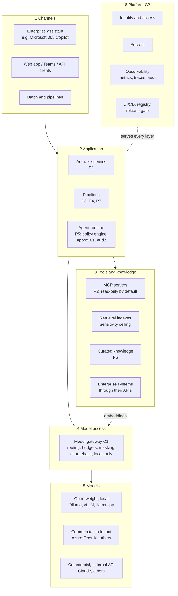
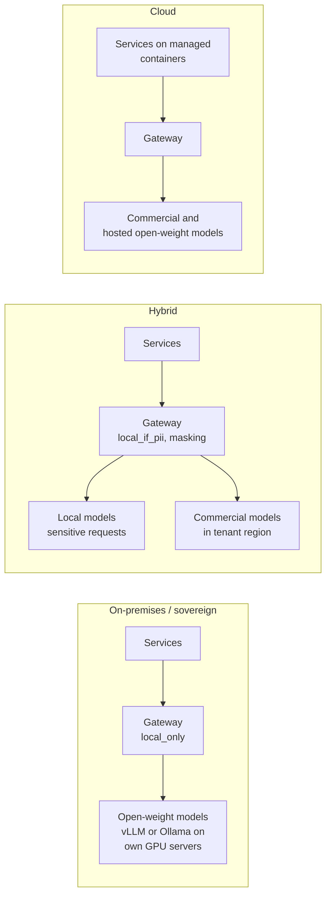

# Reference architecture

Version 0.1 · The layers every AI service is built from, the contracts between them, and the
three ways the same services are deployed.

## Layers

| Layer | Responsibility | Contract to the layer below | Reference |
|---|---|---|---|
| 1 Channels | Where people meet the service | HTTP API, MCP, or files | template `api.py`; copilot-team-knowledge |
| 2 Application | The workflow: what is retrieved, what the model is asked, what is checked, who approves | Python functions; MCP for tools | template `service.py`; governed-agents |
| 3 Tools and knowledge | Governed access to documents, data and systems | MCP (tools), retrieval API | policy-evidence-mcp |
| 4 Model access | One door to every model: who may use which, at what cost, with what data | OpenAI-compatible chat and embeddings | governed-llm-gateway |
| 5 Models | Inference | OpenAI-compatible API | Ollama, vLLM, cloud |
| 6 Platform | Identity, secrets, observability, delivery | Containers, environment, OpenTelemetry / Prometheus | governed-ai-platform |

## Contracts

Three contracts keep the layers replaceable:

1. **Models: the OpenAI-compatible API.** Every application talks to models in this format,
   usually through the gateway. Ollama, vLLM, llama.cpp's server, LM Studio and the main cloud
   providers all speak it, so a model change is configuration. See
   [ADR 0002](adr/0002-openai-compatible-contract.md).
2. **Tools: the Model Context Protocol (MCP).** A tool built once (a statistics API, a document
   index, a case system) serves every agent and assistant that speaks MCP. Servers are read-only
   by default; a tool that writes or leaves the organisation declares it, and the agent runtime's
   policy engine decides each call. See [ADR 0003](adr/0003-mcp-for-tools.md).
3. **Operations: one audit line per request.** Every service writes structured events with
   what happened, which model, tokens, latency and status, and never the content. Metrics and
   cost reports are built from them.

## Deployment topologies

The topology follows the data (see [use-case intake](use-case-intake.md)), not the preference
for a model.

| Topology | When | Models | What never happens |
|---|---|---|---|
| **On-premises / sovereign** | Restricted or confidential information; no approved external processor; air-gapped networks | Open-weight models on the organisation's hardware | No request leaves; the gateway has no external route configured |
| **Hybrid** | Internal information; personal data possible | Commercial models in the organisation's tenant and region for most work; local models for requests with personal data or flagged teams | Personal data reaching an external model unmasked |
| **Cloud** | Public or low-sensitivity information; elastic demand | Commercial and hosted open-weight models | Untracked spend: every call is budgeted and charged back |

`governed-ai-platform` runs all three from one compose file: `sovereign` (open-weight only),
`local` (local plus a commercial fallback), and a cloud mapping to managed services in its
`docs/azure.md`.

## Cross-cutting controls

| Control | Where it is enforced | Why there |
|---|---|---|
| Classification ceiling | Retrieval and MCP servers, at load time | Text that is never loaded cannot leak |
| Personal-data masking, data residency | Gateway | One place, every model |
| Least privilege, autonomy levels, human approval | Agent runtime policy engine | Decided per tool call, in code |
| Budgets and chargeback | Gateway | Spend is visible per team before it is a problem |
| Prompt-injection resistance | Prompts mark content as data; validators and policy engine refuse the outcome | The model may be fooled; the code is not |
| Evaluation gate | CI of every service | Quality is measured on every change |
| Audit without content | Every service | Operable and shareable logs |
